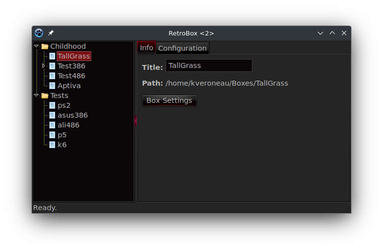

# RetroBox
An emulator management tool for 86Box

This program is not yet ready to be used, it is still under active and heavy development. I will
be committing each update to my Git repository as development proceeds so that people can see
how the program was built in a nice timeline if they so choose to see how it was made.

Currently, it has a basic preferences window to add categories and set a base path.  Existing 86Boxes can be imported, which are then saved to the disk and reloaded back upon reopening the program.

The main idea of the program, is to show a nice tree view with categories to make viewing and
managing your various Retro 86Boxes really easy.  I personally prefer seeing such things in a
tree, so it is much easier to sort and browse when needed.

I am currently planning out how the creation of new 86Boxes will work, as I do not wish to replicate the exising settings window from 86Box itself.  I was thinking of perhaps having various template configurations which new users of 86Box could use to get themselves started without needing to know how each of the settings for each system shoud be set within 86Box.

